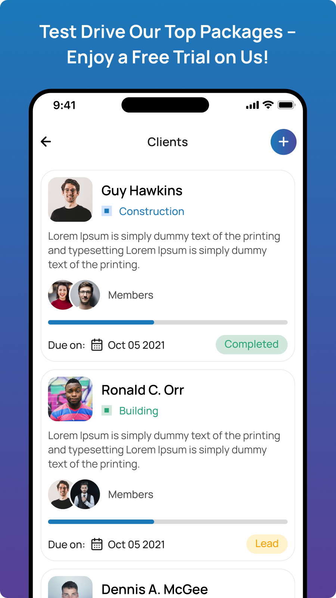

# Comgari

Comgari is a cross-platform CRM for managing leads, clients, team members, appointments, tasks, proposals, notes, media, invoices, and subscriptions.

Built with Expo, React Native, Expo Router, TypeScript, Redux Toolkit, TanStack Query, NativeWind, and Stripe.

## Run locally

```bash
yarn install
yarn start
```

Use `yarn android` or `yarn ios` for a native development build. The app expects the Comgari API and platform credentials to be configured before authentication, payments, notifications, or uploads will work.

## Structure

```text
app/           Expo Router screens and navigation
common/        Shared UI, API configuration, and routes
repositories/  Auth, client, member, and payment data access
store/         Redux state and persistence
hooks/         Upload, notification, and subscription hooks
assets/        Images and fonts
docs/mocks/    Product mockups
```

## Product mockups

<p align="center">
  
  
  
  
  
</p>
